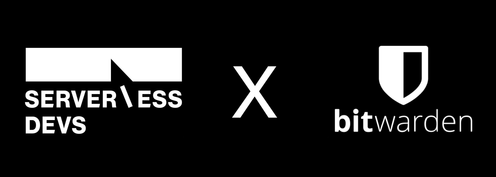

  

  <b>VaultWarden Serverless Devs</b> 

    
  
  

<description>

本项目是基于阿里云函数计算 FC 和 Serverless Devs 一键部署 VaultWarden ，Serverless Devs 是一个开源开放的 Serverless 开发者平台，致力于为开发者提供强大的工具链体系。通过该平台，开发者不仅可以一键体验多云 Serverless 产品，极速部署 Serverless 项目，还可以在 Serverless 应用全生命周期进行项目的管理，并且非常简单快速的将 Serverless Devs 与其他工具/平台进行结合，进一步提升研发、运维效能。

在使用该项目之前，您需要确保已经开通以下服务：

- [函数计算服务](https://common-buy.aliyun.com/package?planCode=package_freetierfc_cn)
- [容器镜像服务](https://cr.console.aliyun.com/cn-hongkong/instances)
- [文件存储服务](https://nasnext.console.aliyun.com/)
- [专有网络服务](https://common-buy.aliyun.com/?commodityCode=vpc)

推荐您拥有以下的产品权限 / 策略：

- 函数计算服务 / AliyunFCFullAccess
- 容器镜像服务 / AliyunContainerRegistryFullAccess
- 文件存储服务 / AliyunNASFullAccess
- 专有网络服务 / AliyunVPCFullAccess

> 💡项目默认使用 serverless-devs 提供的测试域名作为自定义域名，此域名随时可能会被收回，推荐参考绑定个人域名章节重新设置自定义域名。

</description>

## 前提条件

### 容器镜像服务

1. 登录[容器镜像服务控制台](https://cr.console.aliyun.com/?spm=a2c4g.11186623.0.0.53a47b17eCUOUy)。
2. 在顶部菜单栏，选择所需**地域**，在左侧导航栏，选择**实例列表**。
3. 在实例列表页面单击目标**个人版实例**，如有需要请选择创建**个人版实例**。
4. 在个人版实例管理页面选择**仓库管理** > **命名空间**。
5. 在命名空间页面单击**创建命名空间**。
6. 在创建命名空间对话框中设置命名空间名称单击确定。
7. 将新创建的命名空间的**默认仓库类型**设为**私有**并启用**自动创建仓库**选项。

## 应用中心一键部署

通过 [Serverless 应用中心](https://fcnext.console.aliyun.com/applications/create?template=vaultwarden-aliyun) ，点击下面按钮直接部署体验：

部署时需要提供的参数如下：

| 参数       | 类型   | 描述                                                                           | 默认值               |
| --------- | ------ | ----------------------------------------------------------------------------- | -------------------- |
| region    | string | 选择服务所部署的区域，由于大陆部署的自定义域名需要备案，因此更推荐部署在国外区域     | cn-hongkong          |
| database  | string | 如果使用其他数据库实例请提供数据库连接 url，此参数支持 MySQL、PostgreSQL 和 SQLite | /mnt/auto/db.sqlite3 |
| namespace | string | 前提条件中所创建的容器镜像服务命名空间，用来存储 VaultWarden 的镜像                | -                    |
